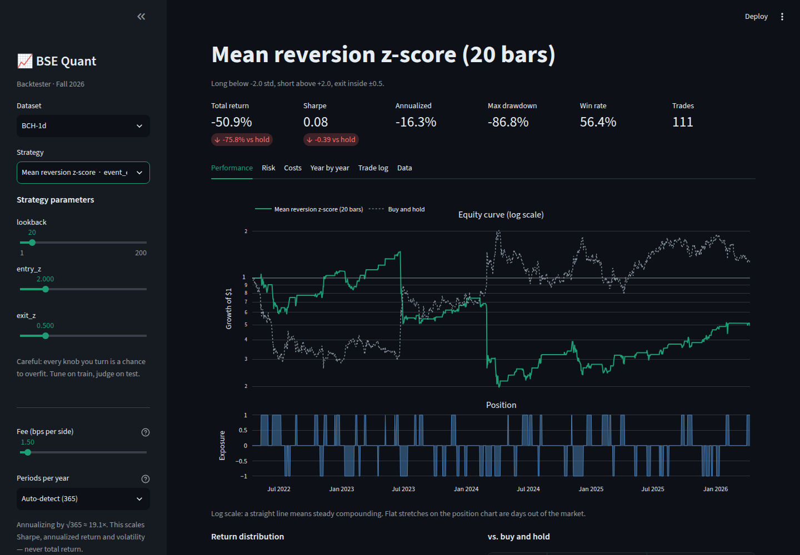
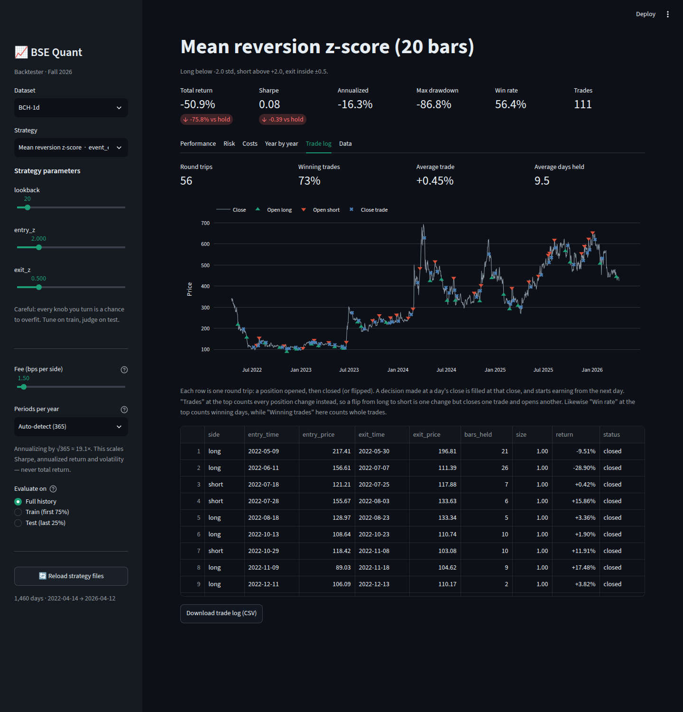
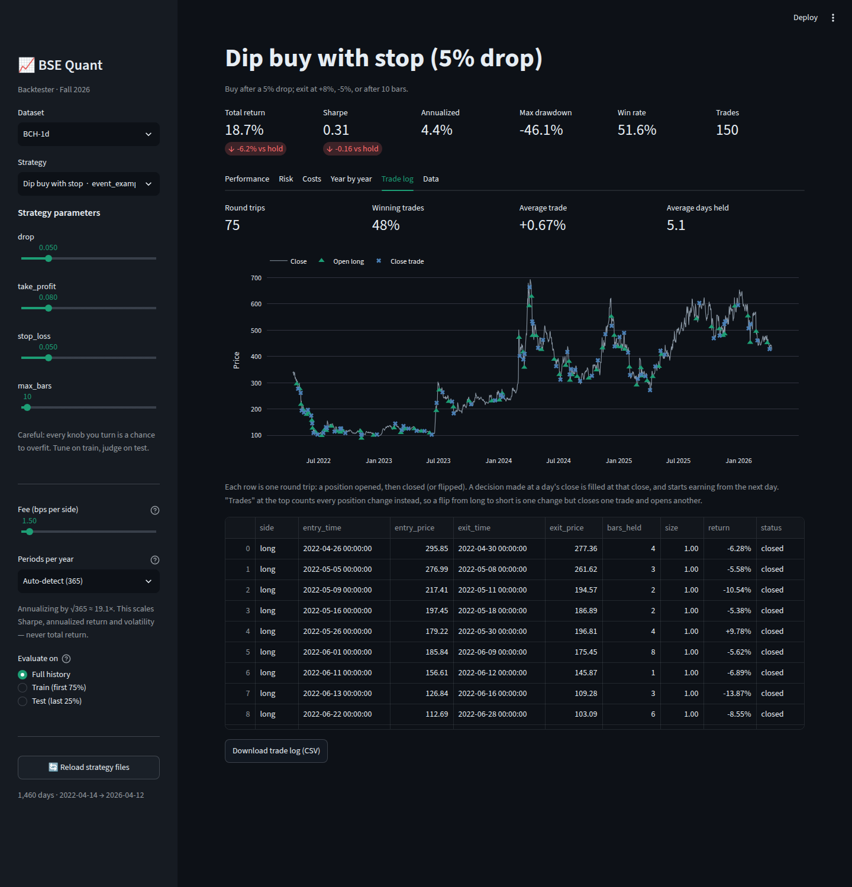
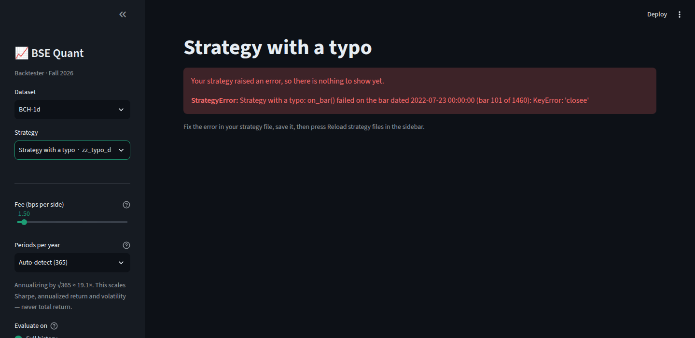

# Report: letting fellows open and close positions bar by bar

Branch: `feature/event-strategies` (off `feature/backtester`). Written
2026-10-05.

## TL;DR

Fellows can now write **any** strategy by telling the backtester when to open
and close positions. They implement one method, `on_bar()`, which the engine
calls once per bar with only the past visible, and inside it they call
`go_long()`, `go_short()` or `go_flat()`:

```python
from bsequant import EventStrategy

class BuyTheDip(EventStrategy):
    name = "Buy the dip"

    def on_bar(self, bar, history):
        average = history["close"].tail(20).mean()
        if self.position == 0 and bar["close"] < average * 0.95:
            self.go_long()          # open
        elif self.position > 0 and bar["close"] >= average:
            self.go_flat()          # close
```

Main points:

- **Timing is exactly as precise as the data.** A decision made at a bar's
  close takes effect from the next bar: once a day on daily data, once an hour
  on hourly data. The loader now reads hourly and other intraday files, plus
  stock exports, so more precision is just a matter of dropping in finer data.
- **Fellows cannot cheat by accident.** `on_bar()` never sees a bar before it
  closes, so no `.shift(1)` is needed. A stricter lookahead test (from
  `PLAN.md` section 6) confirms this for every example.
- **It is built on the existing engine, not beside it.** An `EventStrategy`
  just produces the same position series the engine already understood, so
  every P&L rule in `CLAUDE.md` applies unchanged. The original
  short-term-reversal strategy rewritten in the new style reproduces the
  original positions **bit for bit** (Sharpe 0.8351 at 1.5 bps, same as the
  regression table).
- **New in the app:**
  - a **Trade log** tab (every round trip, with entries and exits marked on
    the price chart);
  - readable error messages that name the bar a strategy failed on;
  - caching so moving the fee slider does not re-run a strategy.
- **There is now a test suite** (47 tests). It passes on Python 3.9 + pandas
  2.3 and on Python 3.11 + pandas 3.0, and every regression number in
  `CLAUDE.md` is unchanged.

The column-at-a-time style (`Strategy.generate_positions`) still works
exactly as before; the event style is now the default in the template.

---

## 1. The problem

The original interface already allowed any strategy *in principle*: a
strategy returns one position per day, and every trading idea is some rule
that turns the past into a position. In practice the interface made fellows
think in whole pandas columns. That is natural for "fade yesterday's move"
but awkward for most real ideas, which are stateful:

- "enter when price is 2 standard deviations below average, **exit when it
  gets back within 0.5**" (where you exit depends on whether you are in a
  trade);
- "buy the breakout, **sell if it falls 5% below where I bought**" (needs
  the entry price);
- "**get out after 10 days** if nothing happened" (needs the holding time).

Each of these is a loop with memory. Writing them as vectorized pandas is
hard for freshmen, and the `.shift(1)` rule is easy to get subtly wrong.

## 2. The design

### 2.1 What a fellow writes

| Call | Effect |
|---|---|
| `self.go_long(size=1.0)` | hold `+size` of equity from the next bar |
| `self.go_short(size=1.0)` | hold `-size` from the next bar |
| `self.go_flat()` | hold nothing from the next bar |
| `self.set_position(x)` | hold exactly `x` from the next bar |

| Read | Meaning |
|---|---|
| `bar` | the bar that just closed (`bar["close"]`; `bar.name` is its timestamp) |
| `history` | all bars up to and including `bar` |
| `self.position` | current position |
| `self.entry_price`, `self.entry_time` | where and when the current trade opened |
| `self.bars_held` | how long the current trade has been held |

The actions set a **target** position rather than placing an order.
`go_long()` while already long does nothing: no double buying and no extra
fee. That removes a whole class of beginner bugs (accidentally building 5x
leverage by calling buy every bar), and it maps directly onto the engine's
existing position convention.

### 2.2 Timing: how precise trades can be

```
bar t closes ──► on_bar(bar t, history 0..t) ──► decision
                                                     │
              filled at bar t's close ◄──────────────┘
                                                     │
bar t+1 ──────────── position earns bar t+1's return ◄┘
```

- A decision is filled at the close of the bar it was made on, and the
  position earns from the next bar onward. This is the same close-to-close
  assumption the engine always made; it is literally what `.shift(1)` did.
- The finest possible timing is one bar. Daily data allows one decision a
  day; hourly data allows one an hour. Nothing finer is invented: you cannot
  act in the middle of a bar, because the backtester does not know what
  happened inside it.
- The last bar's decision has nothing to act on and is dropped, exactly like
  the last value of a `.shift(1)`.

### 2.3 Why it is built on the existing engine

`EventStrategy.generate_positions()` walks the data, calls `on_bar()`, and
records the resulting position series. Everything after that (P&L from simple
returns, compounding, fees on position change, drawdown, Sharpe, warnings) is
the **same code** both styles share.

This was deliberate. `CLAUDE.md` lists invariants that encode bugs found the
hard way (short P&L from log returns inflated results 5x). A second,
event-driven P&L engine would have to re-earn all of that. Instead there is
one engine, and a test proves the event path matches it:
`test_event_version_matches_vectorized_version_exactly` rewrites
`ShortTermReversal` with `on_bar` and checks the positions are identical and
the Sharpe is 0.8351.

To support this, `engine.run()` was split into
`generate_positions()` + `run_positions()`. `cost_sweep()` now runs a strategy
once and re-prices it at each fee level, where before it ran the strategy six
times.

### 2.4 Safety rails for freshmen

- **No lookahead by construction**: `history` is a slice ending at the
  current bar.
- **Fresh state every run**: the strategy is deep-copied before each walk, so
  a counter or trailing high stored on `self` cannot leak from one run into
  the next. Without this, the Performance and Costs tabs could disagree.
- **Errors name the bar.** A typo becomes: *"on_bar() failed on the bar
  dated 2022-07-23 (bar 101 of 1460): KeyError: 'closee'"*, shown in the app
  instead of a stack trace.
- **Bad inputs are rejected with a hint**: `go_long(-1)` says to use
  `go_short()`. Setting `self.position = 1` explains which method to call.

## 3. What fellows see

**Performance tab**, mean reversion example:



**Trade log tab**, new. It shows every opened and closed trade on the price
chart and in a table, so fellows can check that their code trades where they
meant it to:



The dip-buy example uses a stop-loss, a profit target and a time limit, all
visible in the log:



**When a strategy has a bug:**



## 4. Example strategies

`strategies/event_examples.py` has one example of each kind of idea. The
template `my_strategy.py` is now an `EventStrategy` with
indicator → open → close steps. Results on `BCH-1d`:

| Strategy | Sharpe @1.5 bps | Sharpe @10 bps | Return @10 bps | Max DD | Round trips | Winning trades | Train / Test Sharpe @10 bps |
|---|---|---|---|---|---|---|---|
| Buy and hold (benchmark) | 0.47 | 0.47 | +24.7% | -74.0% | 1 | – | 0.43 / 0.65 |
| Mean reversion z-score | 0.08 | 0.04 | -55.4% | -87.0% | 56 | 73% | -0.20 / 1.37 |
| Breakout momentum | 0.24 | 0.23 | -10.5% | -72.7% | 21 | 38% | 0.12 / 0.24 |
| Dip buy with stop | 0.31 | 0.23 | +4.5% | -46.9% | 75 | 47% | 0.01 / 1.10 |
| Template (`my_strategy.py`) | -0.08 | -0.22 | -84.5% | -91.9% | 263 | 29% | 0.22 / -1.99 |

None beats buy-and-hold convincingly, and I did not tune them to. They exist
to show the *shape* of each idea, and their failures are teaching material:

- **Mean reversion wins 73% of its trades and still loses 55%.** Three shorts
  held into BCH rallies lost 62%, 56% and 32%. This is the clearest possible
  lesson on why win rate is not edge, and why stops matter.
- **The dip buyer's 5% stop exits at up to -15%** on gap days, because stops
  are checked at the close (see section 6).
- **Train vs Test swings wildly** (mean reversion: -0.20 vs 1.37). With about
  50 trades, results are noise-dominated, which is the overfitting lesson
  `PLAN.md` wants to teach.

## 5. Verification

| Check | Result |
|---|---|
| `pytest` suite (47 tests) on Python 3.11, pandas 3.0.6, Streamlit 1.64 | all pass |
| Same suite on Python 3.9.25, pandas 2.3.3, Streamlit 1.50 (the oldest Python `CLAUDE.md` promises) | all pass |
| Same suite on pandas 2.0.3, numpy 1.x (no Streamlit) | all pass, app test skipped |
| `CLAUDE.md` regression table, yearly returns, cheater warning | unchanged, now automated |
| Event rewrite of `ShortTermReversal` vs original | identical positions; Sharpe 0.9028 / 0.8351 |
| Truncation lookahead test on every event example (scramble bar *k* up and down, drop the future, position at *k* unchanged) | pass |
| App smoke test (every strategy renders, 6 tabs, no errors) | pass |
| A deliberately broken strategy in the app | readable error naming the bar |
| `compete.py` with an `EventStrategy` submission | runs and ranks normally |
| Hourly crypto file (synthetic) in the app | loads, auto-detects 8,760 bars/yr, labels switch to "bars" |
| Stock file with a 4:1 split and `Adj Close` (synthetic) | adjusted close used; no fake -75% day; 252 bars/yr |

The tests live in `backtester/tests/`. Run them with
`pip install -r requirements-dev.txt` then `python -m pytest`, from
`backtester/`.

## 6. Limitations

- **Fills happen at the close.** Stops and targets are checked against the
  close, not the bar's high or low, so a gap can exit past the stop.
  Intrabar fills (did the low touch my stop?) would need high/low fill logic
  and an assumption about the order things happened inside the bar. I left
  that out to keep the model simple and honest; it is the natural next
  extension if you want it.
- **Speed.** The bar loop costs about 70 µs per bar, plus whatever the
  fellow's `on_bar` does (about 130 µs for a rolling mean and std). A year of
  daily data runs in about 0.1–0.3 s; a year of hourly data in about 1.8 s;
  four years of hourly data in about 7 s. The app caches positions, so only
  changing the strategy, its parameters, the dataset or the period re-runs
  it; fees and tabs are instant. Minute data over years would be slow. The
  column-at-a-time style remains for that.
- **No real intraday dataset ships.** The loader is ready, but the only
  bundled data is still daily BCH. Intraday files were tested with synthetic
  data because data sites are blocked from my environment.
- **The trade log's per-trade return is a summary.** It compounds the held
  bars and subtracts entry and exit fees. The equity curve stays the exact
  record.
- **Two meanings of "trades" and "win rate".**
  - The headline **Trades** counts position changes (774 for reversal); the
    Trade log counts round trips (773).
  - The headline **Win rate** counts winning days; the Trade log's **Winning
    trades** counts winning trades.

  I kept the headline metrics unchanged because the regression table pins
  them, and explained the difference in the tab's caption. Renaming the
  headline to "Position changes" would be cleaner if you are OK moving that
  label.
- **Still open from `PLAN.md`, not touched here:**
  - the Streamlit `use_container_width` deprecation;
  - the Windows UTF-8 crash in `compete.py`'s HTML output;
  - HTML escaping and a timeout per submission in `compete.py`;
  - the app's 1.5 bps default fee vs the competition's 10 bps.

## 7. Other things that changed

- **Data loader.**
  - Recognizes common column names: Yahoo `Date, Open, ..., Adj Close`;
    exchange `open_time` in Unix ms; `timestamp`; the BCH short names.
  - Prefers adjusted close; converts time zones to UTC; sorts.
  - Drops exact duplicate rows, and rejects conflicting ones and
    non-positive prices with clear messages.
  - Accepts a path to a CSV outside `data/`, so `compete.py --data` can point
    at a private held-out file.
  - Every dataset now returns the same seven columns. BCH's extra `trades`
    column is no longer exposed, so a strategy cannot depend on a column the
    competition data lacks.
- **App.**
  - Trade log tab.
  - Error display.
  - Position caching.
  - "Day" labels become "bar", "week" or "month" when the data is not daily.
  - Strategies without a `name` no longer hide each other in the dropdown.
- **`compete.py`** shows each strategy's full run-time name, for example
  "Mean reversion z-score (20 bars)".
- **Template.**
  - `my_strategy.py` is now an `EventStrategy`.
  - The old column-style template is still documented in the README
    ("The other way") and is in git history.
  - `examples.py` is untouched.

## 8. Decisions for you

| # | Question | What I did / default |
|---|---|---|
| E1 | Make `EventStrategy` the default style fellows learn first? | Yes: the template and README lead with it. The column style is presented as the faster alternative. |
| E2 | Rename the headline "Trades" to "Position changes"? | Not done (it is a regression-pinned label); explained in the caption instead. |
| E3 | Add intrabar stop/target fills using high/low? | Not done; fills at close, documented. Happy to add as an opt-in. |
| E4 | `PLAN.md` decision D1 proposed plain functions instead of classes. | Superseded for now: open/close logic needs memory (entry price, bars held), which a class gives naturally. A function-style wrapper is still possible for the simplest strategies. |
| E5 | Ship a real intraday dataset (for example BTC-1h)? | Needs a data source you are comfortable with; the loader is ready. |

## 9. Files

```
backtester/bsequant/strategy.py     EventStrategy, StrategyError
backtester/bsequant/engine.py       run_positions(), trade_log(), cost_sweep reuse
backtester/bsequant/data.py         generalized load()
backtester/bsequant/__init__.py     exports
backtester/strategies/event_examples.py   3 new examples
backtester/strategies/my_strategy.py      template, now event-style
backtester/app.py                   Trade log tab, errors, caching, labels
backtester/compete.py               run-time strategy names
backtester/tests/                   47 tests
backtester/requirements-dev.txt     pytest
backtester/README.md, CLAUDE.md     docs and invariants
backtester/docs/EVENT_STRATEGIES.md this report (+ docs/img/)
```

Merging: this branch sits on top of `feature/backtester`, which sits on top
of `rewrite`, so each step of `feature/event-strategies` → `feature/backtester`
→ `rewrite` → `main` merges without conflicts.
